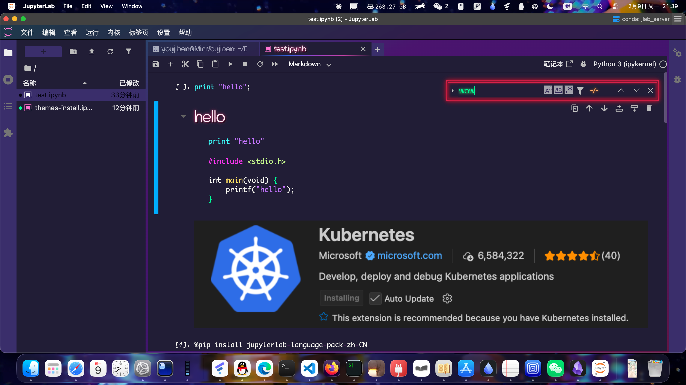

# JupyterLab Neon Theme (JupyterLab 4.x Migration)

This is a migration of [jupyterlab-neon-theme](https://github.com/yeebc/jupyterlab-neon-theme) from JupyterLab 3.x to JupyterLab 4.x.

A flat, 80's neon inspired theme for JupyterLab 4.x.



## Features

- 80's Cyberpunk Neon style
- Support for JupyterLab 4.x

## Installation

Download the `.whl` file from [GitHub Releases](https://github.com/inorganben/jupyterlab-neon-theme/releases) and run:

```bash
pip install *.whl
```

## Related Projects

- [jupyterlab-miami-nights](https://github.com/timkpaine/jupyterlab_miami_nights) - Another neon/cyberpunk theme for JupyterLab


For more screenshots and documentation, please visit [yeebc/jupyterlab-neon-theme](https://github.com/yeebc/jupyterlab-neon-theme).

## License

BSD-3-Clause

---

## 中文说明

移植自 yeebc/jupyterlab-neon-theme，适配 JupyterLab 4.x。

一款受 80 年代霓虹灯风格启发的深色主题，支持渐变滚动栏、霓虹灯特效等。

安装：从 [GitHub Releases](https://github.com/inorganben/jupyterlab-neon-theme/releases) 下载 `.whl` 文件后运行 `pip install *.whl`
